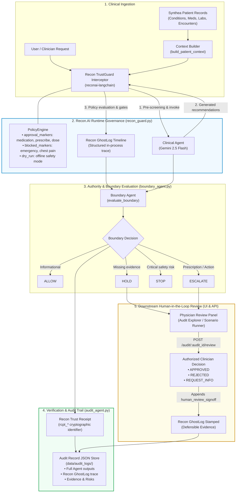

# Healthcare Boundary Testing Context Builder

This repository component converts raw Synthea CSV records into a normalized, JSON-serializable patient context for downstream boundary-testing research.

It performs data loading and transformation only. It does not contain LLM agents, clinical recommendations, a boundary engine, an API, or a user interface.

## Required input files

Place these files in one directory:

- `patients.csv`
- `conditions.csv`
- `medications.csv`
- `observations.csv`
- `encounters.csv`

## Installation

Create and activate a Python virtual environment, then install the dependencies:

```text
pip install -r requirements.txt
```

## Usage

Add `src` to the Python import path and call `build_patient_context` with a patient ID and CSV directory:

```text
from context_builder import build_patient_context

context = build_patient_context(
    "2c71dd97-7085-416a-aa07-d675bbe3adf2",
    "/home/ayush/Downloads/synthea_sample_data_csv_apr2020/csv",
)
```

The returned dictionary has five top-level keys:

- `patient`
- `conditions`
- `medications`
- `observations`
- `encounters`

All child records are chronologically sorted. Missing CSV values become `None`. Dates and timestamps are normalized to ISO-8601 strings. Age is calculated at the latest dated record in the assembled context, which keeps historical dataset output stable.

For repeated patient lookups, load the CSV files once:

```text
from context_builder import build_patient_context, load_data

data = load_data(r"C:\path\to\synthea\csv")
context = build_patient_context("patient-id", data=data)
```

## Logging

The module uses Python's standard `logging` package. Applications can configure handlers and levels. Logs contain file and record counts, not patient clinical values.

## Tests

From the repository root:

```text
python -m pytest
```

The tests cover valid and invalid patients, missing values, chronological ordering, and empty observations.

## Clinical Analysis Agent

`src/clinical_agent.py` provides a bounded Gemini-powered analysis component
using `gemini-2.5-flash`. It accepts a normalized patient context and user
request, then returns structured analysis, evidence, reasoning, uncertainties,
recommendation, confidence, a numeric confidence score and reason, and an
authority-required indicator.

The agent does not diagnose, prescribe, change medication, or execute actions.
Applications may pass an existing `google.genai.Client`, or allow the module to
create one using the SDK's standard `GEMINI_API_KEY` environment configuration.

```text
from clinical_agent import analyze_patient

result = analyze_patient(context, "Summarize relevant evidence for review.")
```

Unit tests use mock Gemini responses and make no external API calls.

### Gemini API key

Copy your Gemini API key into the project-root `.env` file:

```text
GEMINI_API_KEY=your_actual_key_here
```

The Clinical Agent, Boundary Agent, and Scenario Runner load this file
automatically. `.env` is excluded from Git; `.env.example` documents the
required variables without containing secrets. Explicit `api_key` function
arguments still take precedence over `.env` values.

## Boundary Evaluation Agent

`src/boundary_agent.py` independently reviews a Clinical Analysis Agent packet
with `gemini-2.5-flash`. It evaluates evidence sufficiency, uncertainty,
authority, safety, confidence, and possible urgency before dynamically returning
`ALLOW`, `HOLD`, `ESCALATE`, or `STOP` with a concise rationale, risks, and
required actions.

The four outcomes define the evaluation vocabulary; medical conditions and
confidence values are not mapped to decisions through hardcoded rules. Tests
use injected mock clients and make no external Gemini requests.

`HOLD` is intended for incomplete or unclear information requiring low-urgency
clarification without immediate danger. `ESCALATE` is intended for material
clinical risk, evidence of deterioration, specialist review, or prompt physician
intervention. Gemini evaluates these factors together at runtime.

The Boundary Agent applies the priority order `STOP → ESCALATE → HOLD → ALLOW`.
It first distinguishes current emergency reports from historical events, then
checks whether the requested action requires treatment authority, then checks
whether blocking ambiguity requires clarification, and finally permits bounded
informational work. The rubric is implemented in the Gemini prompt rather than
as scenario-name or diagnosis-based branching code.

## Audit & Traceability Agent

`src/audit_agent.py` creates versioned audit records from Clinical Agent and
Boundary Agent outputs. Records contain the two concise rationales, evidence,
risks, required actions, scenario metadata, and a structured lifecycle trace.
The complete normalized Clinical and Boundary Agent packets are retained as
nested snapshots alongside the requested top-level summary fields.
The trace supports explainability without attempting to store private model
chain-of-thought.

Audit records are saved atomically as JSON under `data/audit_logs/` by default.
Existing records are not overwritten unless explicitly requested.

```text
from audit_agent import generate_audit_record, save_audit_record

record = generate_audit_record(
    scenario_id="scenario-001",
    patient_id="patient-id",
    clinical_output=clinical_result,
    boundary_output=boundary_result,
)
path = save_audit_record(record)
```

## Scenario Runner

`src/scenario_runner.py` orchestrates the complete context → Clinical Agent →
Boundary Agent → Audit Agent pipeline. Scenario definitions are stored under
`data/scenarios/`, audit records under `data/audit_logs/`, and completed results
under `data/results/`.

Set the Synthea CSV directory, then run one of the four scenarios:

```text
set SYNTHEA_DATA_DIR=C:\path\to\synthea\csv
python src/scenario_runner.py allow
python src/scenario_runner.py hold
python src/scenario_runner.py escalate
python src/scenario_runner.py stop
```

Alternatively, pass `--data-dir`. Scenario labels are used only to load test
inputs and are withheld from both Gemini reasoning agents, so they cannot
directly determine the Boundary Agent's output.

## FastAPI backend

The production API entrypoint is `src.api.main:app`. It reuses the existing
Context Builder, Clinical Agent, Boundary Agent, Audit Agent, and Scenario
Runner through an application service layer.

Start the backend from the repository root:

```text
uvicorn src.api.main:app --reload
```

The `.env` file supplies `GEMINI_API_KEY` and `SYNTHEA_DATA_DIR`. Interactive
OpenAPI documentation is available at:

- `http://127.0.0.1:8000/docs`
- `http://127.0.0.1:8000/redoc`

Available endpoints:

- `GET /health`
- `GET /scenarios`
- `POST /run-scenario`
- `POST /analyze`
- `GET /audits`
- `GET /audit/{audit_id}`
- `POST /audit/{audit_id}/review`

The API uses strict Pydantic v2 request models, centralized JSON error
responses, request IDs, structured logs, atomic JSON persistence, and injected
Gemini clients in unit tests. It does not add a database, UI, authentication,
or duplicate agent implementations.

## Recon.AI Runtime Governance & HITL Review

The platform integrates the client's **Recon.AI** governance framework and `reconai-langchain` SDK (`src/recon_guard.py`):



1. **Recon TrustGuard Interceptor:**
   - Evaluates patient analysis requests and responses through in-process `PolicyEngine`.
   - Flags clinical approval markers (`medication`, `prescribe`, `adjust dose`, `change medication`) and blocks critical markers (`emergency`, `chest pain`).
   - Runs in offline `dry_run=True` mode when an API key is not present, ensuring zero external dependency failures during local/sandboxed testing.
2. **Recon GhostLog Execution Timeline:**
   - Emits structured, step-by-step governance traces for agent invocations, policy evaluations, and decision gates.
   - Preserved in immutable JSON audit records alongside Clinical and Boundary agent outputs.
3. **Recon Trust Receipts:**
   - Stamps each boundary decision with a unique, cryptographically verifiable Trust Receipt identifier (`rcpt_*`).
4. **Human-in-the-Loop (HITL) Physician Review:**
   - When a boundary decision is `HOLD` or `ESCALATE`, the platform provides an interactive clinician review interface.
   - Authorized clinicians can review evidence, select `APPROVED`, `REJECTED`, or `REQUEST_INFO`, and add clinical rationale.
   - The sign-off event is stamped directly onto the Recon GhostLog timeline and persisted in the audit store.

## Streamlit frontend

The frontend in `ui/` communicates exclusively with the FastAPI endpoints. It
contains Dashboard, Scenario Runner, Patient Analysis, and Audit Explorer pages
with reusable decision, audit, and Recon Trust Receipt components.

The Chat Boundary Lab adds an audited conversational view. Every submitted
message calls the real `/analyze` endpoint, retrieves the resulting audit by ID,
and displays the agent response, boundary decision, Recon Trust Receipt, confidence,
authority flag, risks, required actions, and full structured reasoning trace.

Start FastAPI first, then launch Streamlit in a second terminal:

```text
uvicorn src.api.main:app --reload
streamlit run ui/app.py
```

The frontend reads `API_BASE_URL`, defaulting to `http://localhost:8000`.
Scenario execution retrieves the generated audit through the API to display the
complete Clinical Agent and Boundary Agent outputs. Audit and analysis results
can be downloaded as JSON.

Streamlit's automatic `pages/` navigation is disabled in `.streamlit/config.toml`
because this frontend uses its own professional sidebar navigation. The same
configuration forces a high-contrast light theme across browser preferences.
